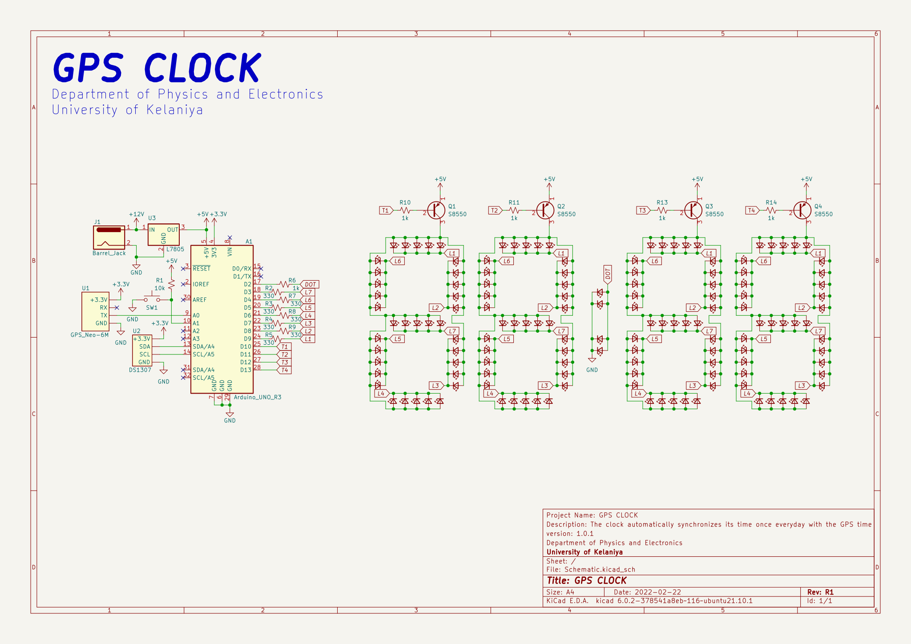

# GPS Clock

## Description
The clock automatically synchronizes its time with the GPS time once every day. If needed, the time can be synchronized manually by clicking the push button on the side of the clock.

## Components
1. 1 × Arduino Uno
2. 144 × 5mm Red LEDs
3. 1 × DS1307 RTC module
4. 1 × NEO-6M GPS Module with an antenna
5. 1 × LM7805 5V Regulator
6. 1 × 12V-1A Power Adapter
7. 7 × 330Ω resistors
8. 6 × 1kΩ resistors
9. 1 × 10kΩ resistor
10. 4 × S8550 PNP Transistors
11. 1 × Barrel Jack
12. 1 × Push Button
## Schematic
